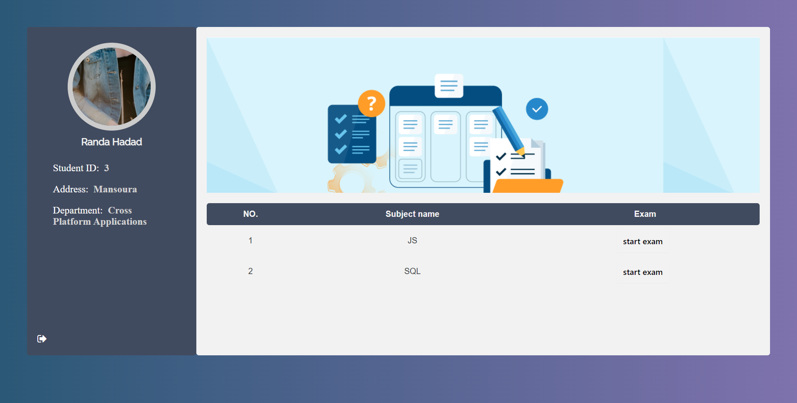
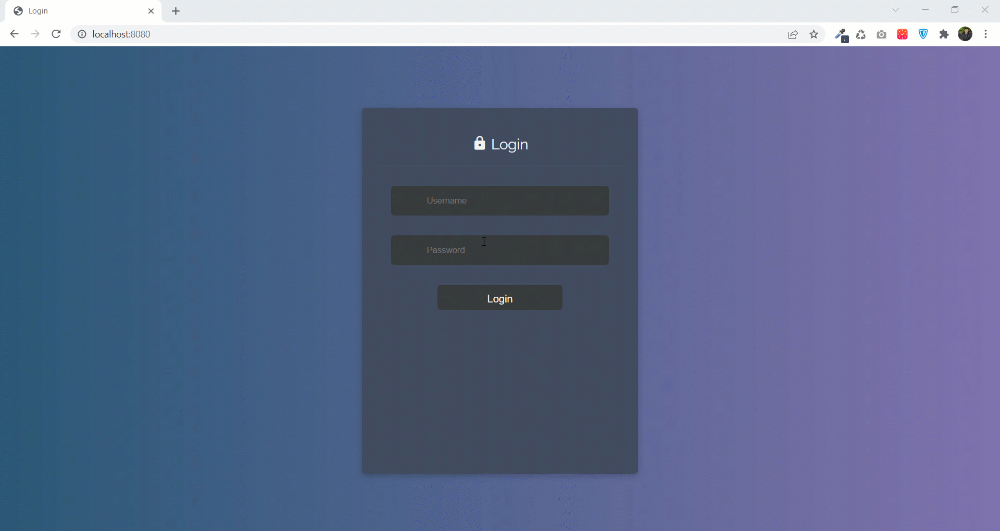
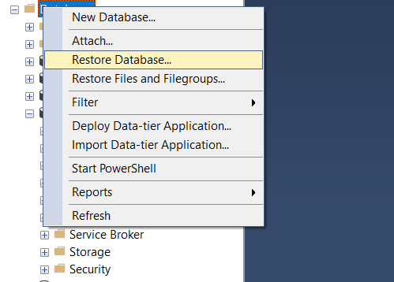
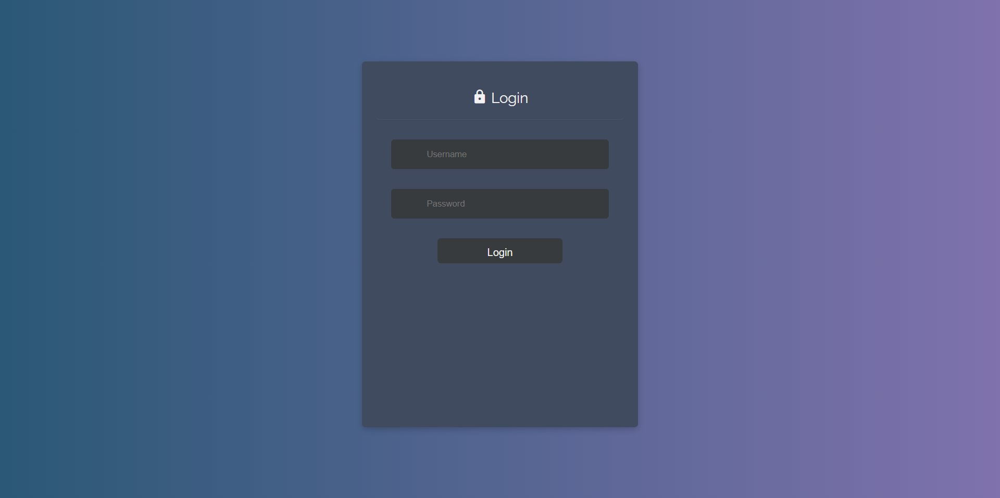

[](#contributors)
# Examination System

A web application that generates exams for students and save their grades

## Table of Contents
<!-- TABLE OF CONTENTS -->
- [Examination System](#examination-system)
  - [Table of Contents](#table-of-contents)
  - [About The Project](#about-the-project)
    - [Built With](#built-with)
  - [Getting Started](#getting-started)
    - [Prerequisites](#prerequisites)
    - [Installation](#installation)
  - [Usage](#usage)
  - [Contributors](#contributors)

<!-- ABOUT THE PROJECT -->

## About The Project



This is a Nodejs Project connected with a sql server database. It is made for sql server course as a project.

During the pandamic every university or educational place had and still has to have an online examination system for their students to make their exams in it.

- Every student has an exam have to open the system and start his/her exam and the grade is calculated after the exam ends so the student can know the grade through his/her account in this course or subject.


- Every instructor can discover his/her student's grade in his/her courses



- If you are student you will go to your pages as a student and if you are instructor you will go to your own pages in the system


<p align="right">(<a href="#examination-system">back to top</a>)</p>

### Built With

This application built with node js and uses sql server database to run.

- [Nodejs](https://nodejs.org/)
- [EJS](https://ejs.co/)
- [Bootstrap](https://getbootstrap.com)

<p align="right">(<a href="#examination-system">back to top</a>)</p>

## Getting Started

How to set the project locally?

### Prerequisites

- Nodejs

  ```sh
  npm install npm@latest -g
  ```

- Sql Server

### Installation

1. Clone the repository

```sh
git clone git@github.com:RandaHadad/Database-Project
```

2. Restore the database backup to your local machine and set a user for the database as a database owner to configure with the web application



1. Go to Nodejs Folder in the application

```sh
cd Nodejs
```

4. Install NPM packages

```sh
npm install
```

5. Go to `dbConfig` js file to write your sql server database configurations
  
```js
const config = {
    server: 'localhost',
    authentication: {
        type: 'default',
        options: {
            userName: 'ExaminationUser', // update me
            password: 'pass' // update me
        }
    },
    options: {
        database: 'Exam_System', // update me
        validateBulkLoadParameters: false,
        encrypt: false,
    }
};
```

<p align="right">(<a href="#examination-system">back to top</a>)</p>

<!-- USAGE EXAMPLES -->

## Usage

1. Write this command to run the project

```sh
 npm start
```

2. Go to your browser and write _localhost:8080_ to run the project

<!-- 3. Here we can see the functionalities of the system with a video
[](assets/video/DB_Project.mp4) -->

<p align="right">(<a href="#examination-system">back to top</a>)</p>

<!-- CREDITS -->

## Contributors

Thanks for you all

- Alaa Maher
- [Amr Elauoty](https://github.com/amrelauoty)
- Eslam Aboalela
- [Mohamed Najeeb](https://github.com/MoNajeeb)
- [Randa Hadad](https://github.com/RandaHadad)

<p align="right">(<a href="#examination-system">back to top</a>)</p>
